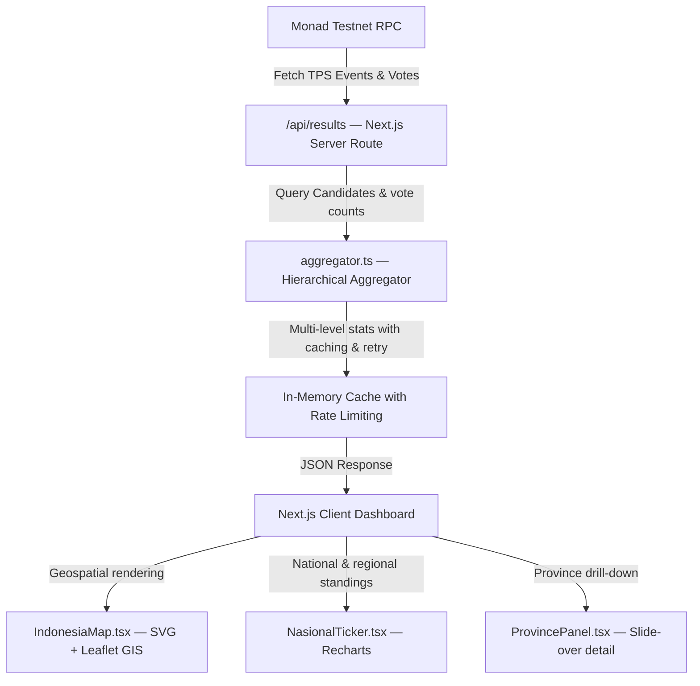

<div align="center">

# GlassviewProject · PrismSphere

### Real-Time Blockchain Election Results & Analytics Dashboard

[](https://nextjs.org/)
[](https://react.dev/)
[](https://www.typescriptlang.org/)
[](https://tailwindcss.com/)
[](https://thirdweb.com/)
[](https://monad.xyz/)
[](LICENSE)

<br/>

> **PrismSphere** is the public-facing real-count and election analytics platform within the **GlassviewProject** ecosystem. It connects directly to the Monad Testnet blockchain to aggregate, verify, and visualize election results in real time — without any intermediary database or centralized server.

</div>

---

## Overview

PrismSphere serves as the **public transparency layer** of the GlassviewProject voting infrastructure. While [DayBreak](https://github.com/Yeichiro/Daybreak) handles secure credential issuance and ballot submission, PrismSphere reads the immutable on-chain results and presents them through a rich, interactive analytics interface.

| Property | Detail |
|---|---|
| **Data Source** | Monad Testnet smart contract (read-only, no writes) |
| **Network Posture** | Public-facing web application |
| **Deployment** | Hostable on Vercel, Railway, or any Node.js environment |
| **Authentication** | None required — fully public read-only dashboard |

---

## System Architecture



---

## Features

### Blockchain-Native Data Source
All election results are derived directly from on-chain events emitted by the DayBreak voting smart contract. No database is used — every fact displayed is backed by a cryptographic transaction on Monad Testnet.

### Interactive Geospatial Visualization
A high-performance SVG + Leaflet hybrid map of Indonesia (`IndonesiaMap.tsx`) renders real-time candidate standings at the province and city level. Province fill colors update dynamically to reflect leading candidates.

### Live Charting & Statistics
Recharts-powered visualizations (`NasionalTicker.tsx`) display:
- National candidate standings and percentages
- DPT participation rates
- Regional breakdowns
- Animated real-time tickers

### Province Drill-Down Panel
A slide-over sidebar (`ProvincePanel.tsx`) provides city and district-level results, candidate breakdowns, and historical comparison when a province is selected on the map.

### Multi-Language Engine
Real-time full UI translation supporting **7 languages**: Indonesian, Malay, English, Chinese, Korean, Japanese, and Arabic.

### High-Throughput Aggregation Core
The server-side aggregator (`lib/aggregator.ts`) features:
- In-memory caching with configurable TTL
- Exponential backoff with jitter on RPC failures
- Rate-limiting batch queues to prevent node congestion

---

## Technology Stack

| Layer | Technology |
|---|---|
| **Framework** | Next.js 16 (App Router), React 19 |
| **Language** | TypeScript 5 |
| **Blockchain** | Monad Testnet (EVM-compatible), Chain ID `10143` |
| **Web3 SDK** | Thirdweb SDK v5 |
| **Mapping** | Leaflet, React Leaflet, D3-geo, TopoJSON |
| **Charts** | Recharts |
| **UI** | Tailwind CSS v4, Framer Motion, Lucide React |
| **Logging** | Pino |

---

## Project Structure

```
PrismSphere/
├── app/
│   ├── api/
│   │   └── results/            # Blockchain aggregation endpoint
│   ├── globals.css             # Tailwind v4 design tokens & directives
│   ├── layout.tsx              # Global layout (theme, lang providers)
│   └── page.tsx                # Main dashboard — map, ticker, drawer panel
│
├── components/
│   ├── IndonesiaMap.tsx        # SVG + Leaflet map renderer (province polygons)
│   ├── NasionalTicker.tsx      # National standings, Recharts charts & tickers
│   ├── ProvincePanel.tsx       # Slide-over sidebar for province/city drill-down
│   ├── panel/                  # Nested breakdown panels
│   └── shared/                 # Theme toggles, language picker, shared widgets
│
├── constants/                  # Language dictionaries & localization tables
│
├── lib/
│   ├── aggregator.ts           # Core blockchain query aggregator (cache + retry)
│   ├── color-utils.ts          # Map gradient & candidate color utilities
│   └── map-constants.ts        # Geospatial coordinate systems & mapping data
│
├── public/                     # Static assets (logos, geojson, SVG maps)
├── package.json
└── tsconfig.json
```

---

## Getting Started

### Prerequisites

- Node.js ≥ 20
- npm ≥ 10
- A Thirdweb client ID (free at [thirdweb.com](https://thirdweb.com/))
- The DayBreak voting contract deployed on Monad Testnet

### Installation

```bash
git clone https://github.com/Yeichiro/Glassview.git
cd Glassview
npm install
```

### Environment Configuration

Create a `.env` file in the root directory:

```env
# Thirdweb client ID (public, safe to expose in browser)
NEXT_PUBLIC_THIRDWEB_CLIENT_ID=your_thirdweb_client_id

# Deployed DayBreak voting contract address on Monad Testnet
NEXT_PUBLIC_CONTRACT_ADDRESS=0x...
```

> [!NOTE]
> PrismSphere is **read-only**. It never submits transactions to the blockchain. No private key or admin credential is required.

### Running Locally

```bash
npm run dev
```

Open [http://localhost:3000](http://localhost:3000) to view the dashboard.

### Building for Production

```bash
npm run build
npm start
```

---

## Data Integrity & Security

| Control | Description |
|---|---|
| **No Database Footprint** | All election data is derived directly from on-chain events — no server-side storage of results, eliminating local tampering vectors |
| **Read-Only Blockchain Access** | PrismSphere only calls `view` functions on the smart contract — no write access, no private key |
| **Fail-Safe RPC Operations** | Exponential backoff with jitter, rate-limit queuing, and multi-endpoint fallback prevent data gaps during RPC congestion |
| **In-Memory Caching** | Results are cached server-side with a short TTL, reducing redundant RPC load while keeping data current |

---

## Relationship to GlassviewProject

PrismSphere is part of a three-component election infrastructure:

```
GlassviewProject
├── DayBreak          # Credential issuance (RegistrySystem) + Voting booth (CredentialSystem)
│   └── github.com/Yeichiro/Daybreak
└── PrismSphere       # Public real-count dashboard (this repository)
    └── github.com/Yeichiro/Glassview
```

Both projects share the same Monad Testnet smart contract address.

---

## License

This project is licensed under the **MIT License** — see the [LICENSE](LICENSE) file for details.
